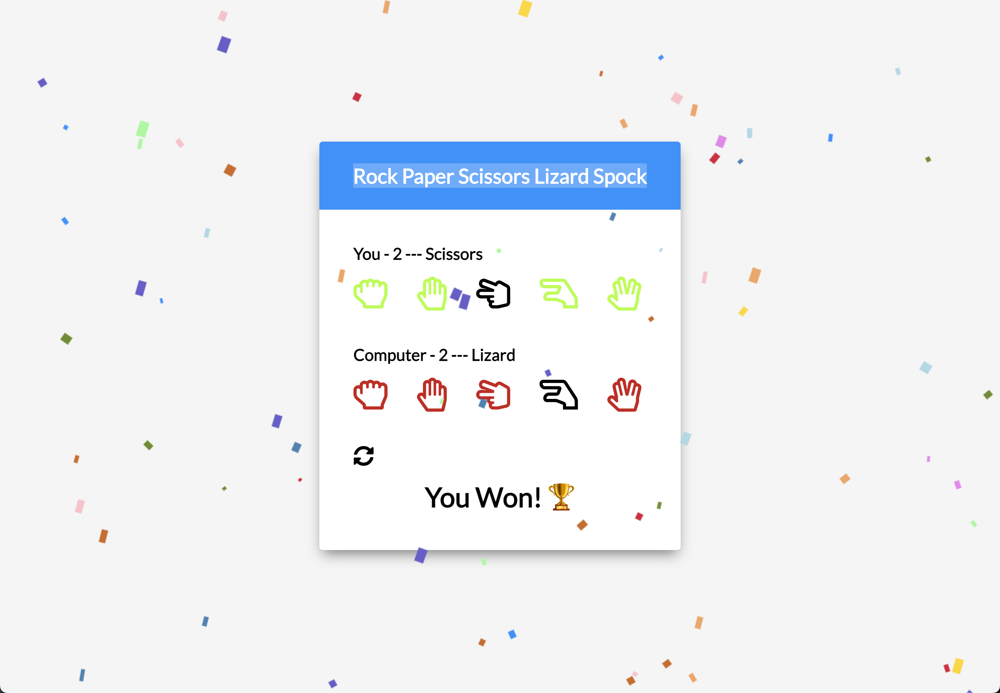

# Rock Paper Scissors Lizard Spock

## URL

https://vasildimov98.github.io/13.spock-rock-game/

## Description

Welcome to the world of Rock Paper Scissors Lizard Spock, the iconic game made popular by the hit TV show "The Big Bang Theory"! Prepare yourself for an exhilarating battle of wits and strategy as you navigate through this JavaScript-powered game.

In this interactive web experience, you'll find yourself immersed in the unique dynamics of Rock Paper Scissors Lizard Spock. Engage in thrilling matches against the computer, putting your decision-making skills to the test.

But don't worry if you're new to the game or need a refresher! We've got you covered. Click here - https://vasildimov98.github.io/13.spock-rock-game/ - to watch a video that provides a comprehensive explanation of the game rules and strategies, straight from "The Big Bang Theory" themselves.

Once you're ready, jump right into the action and challenge the computer to see if you can outsmart it with clever choices and quick thinking. Keep track of your victories and aim for the top of the leaderboard.

So, are you ready to embrace the geeky fun and unpredictable nature of Rock Paper Scissors Lizard Spock? Prepare to channel your inner Sheldon Cooper and embark on an exciting journey through this beloved game. Let the battle begin!

